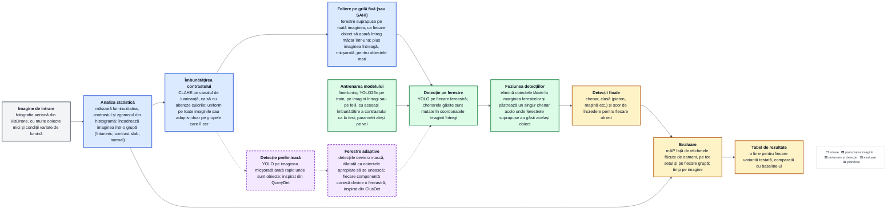

```mermaid
%%{init: {'theme':'base','themeVariables':{'fontSize':'16px','lineColor':'#4B5563'}}}%%
flowchart LR
    A["`**Imagine de intrare**
fotografie aeriană din VisDrone, cu multe obiecte mici și condiții variate de lumină`"]
    B["`**Analiza statistică**
măsoară luminozitatea, contrastul și zgomotul din histogramă; încadrează imaginea într-o grupă (întuneric, contrast slab, normal)`"]
    C["`**Îmbunătățirea contrastului**
CLAHE pe canalul de luminanță, ca să nu altereze culorile; uniform pe toate imaginile sau adaptiv, doar pe grupele care îl cer`"]
    D["`**Feliere pe grilă fixă (sau SAHI)**
ferestre suprapuse pe toată imaginea, ca fiecare obiect să apară întreg măcar într-una; plus imaginea întreagă, micșorată, pentru obiectele mari`"]
    K["`**Detecție preliminară**
YOLO pe imaginea micșorată arată rapid unde sunt obiecte; inspirat din QueryDet`"]
    L["`**Ferestre adaptive**
detecțiile devin o mască, dilatată ca obiectele apropiate să se unească; fiecare componentă conexă devine o fereastră; inspirat din ClusDet`"]
    E["`**Detecție pe ferestre**
YOLO pe fiecare fereastră; chenarele găsite sunt mutate în coordonatele imaginii întregi`"]
    F["`**Antrenarea modelului**
fine-tuning YOLO26n pe train, pe imagini întregi sau pe felii, cu aceeași îmbunătățire a contrastului ca la test; parametri aleși pe val`"]
    G["`**Fuziunea detecțiilor**
elimină obiectele tăiate la marginea ferestrelor și păstrează un singur chenar acolo unde ferestrele suprapuse au găsit același obiect`"]
    H["`**Detecții finale**
chenar, clasă (pieton, mașină etc.) și scor de încredere pentru fiecare obiect`"]
    I["`**Evaluare**
mAP față de etichetele făcute de oameni, pe tot setul și pe fiecare grupă; timp pe imagine`"]
    J["`**Tabel de rezultate**
o linie pentru fiecare variantă testată, comparată cu baseline-ul`"]

    A --> B --> C --> D --> E
    F --> E
    E --> G --> H --> I --> J
    B --> I
    C -.-> K -.-> L -.-> E

    LEG["⬜ intrare &nbsp; 🟦 prelucrarea imaginii &nbsp; 🟩 antrenare și detecție &nbsp; 🟨 evaluare &nbsp; 🟪 planificat"]
    J ~~~ LEG

    classDef inp fill:#F3F4F6,stroke:#374151,stroke-width:2px,color:#111827
    classDef prep fill:#DBEAFE,stroke:#1D4ED8,stroke-width:2px,color:#111827
    classDef det fill:#DCFCE7,stroke:#15803D,stroke-width:2px,color:#111827
    classDef eva fill:#FEF3C7,stroke:#B45309,stroke-width:2px,color:#111827
    classDef plan fill:#F3E8FF,stroke:#7E22CE,stroke-width:2px,stroke-dasharray:6 4,color:#111827
    classDef leg fill:#FFFFFF,stroke:#D1D5DB,stroke-width:1px,color:#374151,font-size:12px

    class A inp
    class B,C,D prep
    class E,F,G det
    class H,I,J eva
    class K,L plan
    class LEG leg
```
