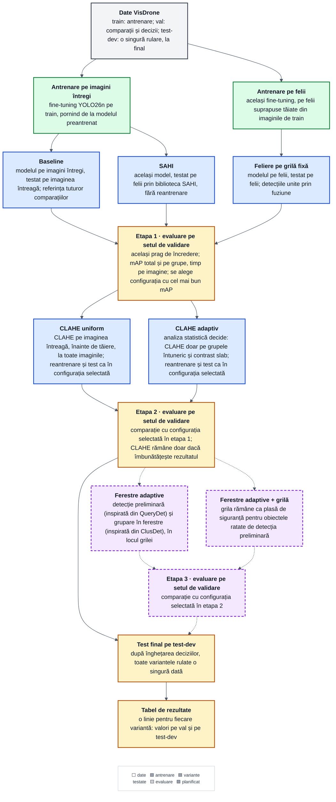

```mermaid
%%{init: {'theme':'base','themeVariables':{'fontSize':'16px','lineColor':'#4B5563'}}}%%
flowchart TB
    V["`**Date VisDrone**
train: antrenare; val: comparații și decizii; test-dev: o singură rulare, la final`"]
    TI["`**Antrenare pe imagini întregi**
fine-tuning YOLO26n pe train, pornind de la modelul preantrenat`"]
    TF["`**Antrenare pe felii**
același fine-tuning, pe felii suprapuse tăiate din imaginile de train`"]

    BL["`**Baseline**
modelul pe imagini întregi, testat pe imaginea întreagă; referința tuturor comparațiilor`"]
    SA["`**SAHI**
același model, testat pe felii prin biblioteca SAHI, fără reantrenare`"]
    GR["`**Feliere pe grilă fixă**
modelul pe felii, testat pe felii; detecțiile unite prin fuziune`"]
    E1["`**Etapa 1 · evaluare pe setul de validare**
același prag de încredere; mAP total și pe grupe, timp pe imagine; se alege configurația cu cel mai bun mAP`"]

    CU["`**CLAHE uniform**
CLAHE pe imaginea întreagă, înainte de tăiere, la toate imaginile; reantrenare și test ca în configurația selectată`"]
    CA["`**CLAHE adaptiv**
analiza statistică decide: CLAHE doar pe grupele întuneric și contrast slab; reantrenare și test ca în configurația selectată`"]
    E2["`**Etapa 2 · evaluare pe setul de validare**
comparație cu configurația selectată în etapa 1; CLAHE rămâne doar dacă îmbunătățește rezultatul`"]

    FA["`**Ferestre adaptive**
detecție preliminară (inspirată din QueryDet) și grupare în ferestre (inspirată din ClusDet), în locul grilei`"]
    FG["`**Ferestre adaptive + grilă**
grila rămâne ca plasă de siguranță pentru obiectele ratate de detecția preliminară`"]
    E3["`**Etapa 3 · evaluare pe setul de validare**
comparație cu configurația selectată în etapa 2`"]

    TD["`**Test final pe test-dev**
după înghețarea deciziilor, toate variantele rulate o singură dată`"]
    TR["`**Tabel de rezultate**
o linie pentru fiecare variantă: valori pe val și pe test-dev`"]

    V --> TI
    V --> TF
    TI --> BL
    TI --> SA
    TF --> GR
    BL --> E1
    SA --> E1
    GR --> E1
    E1 --> CU
    E1 --> CA
    CU --> E2
    CA --> E2
    E2 --> TD
    E2 -.-> FA
    E2 -.-> FG
    FA -.-> E3
    FG -.-> E3
    E3 -.-> TD
    TD --> TR

    LEG["⬜ date &nbsp; 🟩 antrenare &nbsp; 🟦 variante testate &nbsp; 🟨 evaluare &nbsp; 🟪 planificat"]
    TR ~~~ LEG

    classDef dat fill:#F3F4F6,stroke:#374151,stroke-width:2px,color:#111827
    classDef trn fill:#DCFCE7,stroke:#15803D,stroke-width:2px,color:#111827
    classDef var fill:#DBEAFE,stroke:#1D4ED8,stroke-width:2px,color:#111827
    classDef eva fill:#FEF3C7,stroke:#B45309,stroke-width:2px,color:#111827
    classDef plan fill:#F3E8FF,stroke:#7E22CE,stroke-width:2px,stroke-dasharray:6 4,color:#111827
    classDef leg fill:#FFFFFF,stroke:#D1D5DB,stroke-width:1px,color:#374151,font-size:12px

    class V dat
    class TI,TF trn
    class BL,SA,GR,CU,CA var
    class E1,E2,TD,TR eva
    class FA,FG,E3 plan
    class LEG leg
```
